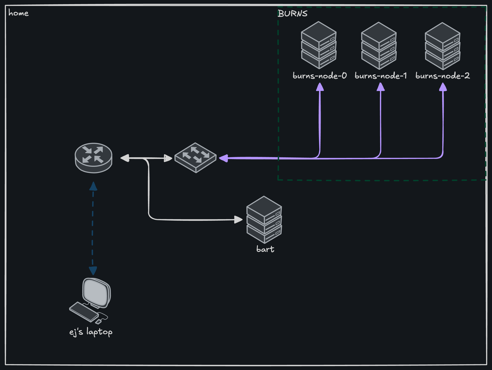
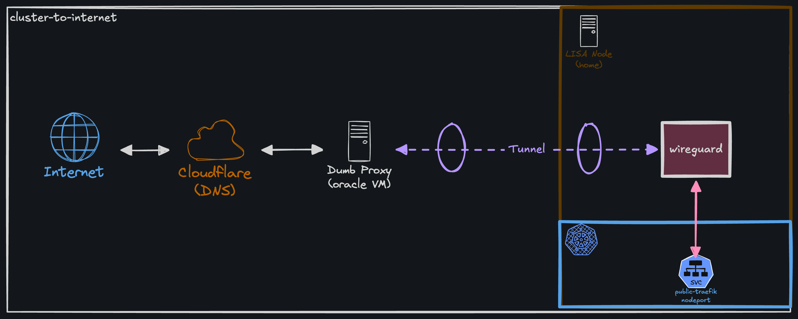
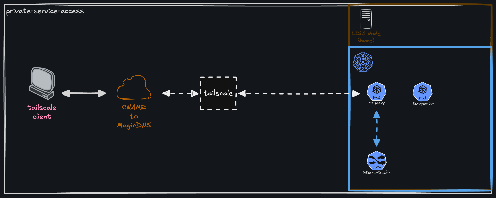
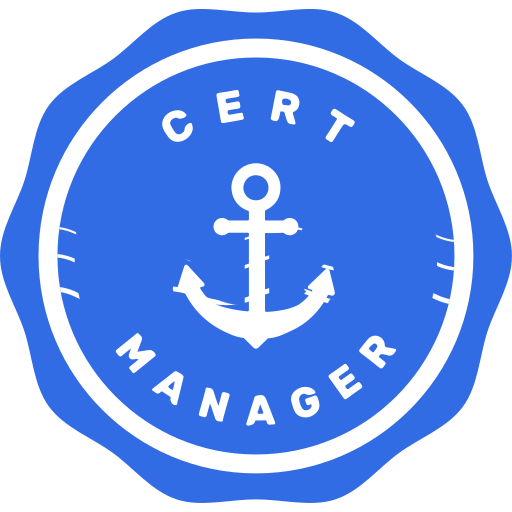

# burns 🐝

This is a git repository for my homelab kubernetes cluster called `burns`. This is the third iteration of my homelab. This iteration is primarily focused around building security and production oriented solutions.

## Architecture

### Nodes

Each node runs Ubuntu as the base OS with [k3s](https://k3s.io).

| Node        | Role   | RAM  | Disk  |
| ----------- | ------ | ---- | ----- |
| lisa-master | Master | 16GB | 512GB |
| lisa-node-1 | Worker | 16GB | 512GB |
| lisa-node-2 | Worker | 16GB | 512GB |

### Network & Access

There are both public and private services running on this cluster. Some services are required to be accessed on the public internet, like authentik, while other services should only be accessible by certain parties who maintain the cluster. While there are lots of ways to restrict this access I went with tailscale as my PAM solution. It allows me to connect multiple devices, nodes, and services within the tailnet. I run two instances of traefik for internal and public traffic so it's as easy as changing the `ingressClassName` to either `internal` or `public` to determine the route of access.

### Internal Network



### Public Access



### Private Access



## Currently Running

Applications are deployed and managed through ArgoCD. This is a list of applications running on-prem.

| Component            | Purpose                                        | Logo                                                       |
| -------------------- | ---------------------------------------------- | ---------------------------------------------------------- |
| ArgoCD               | GitOps continuous delivery                     |            |
| Authentik            | Identity provider (OIDC/SSO)                   |         |
| cert-manager         | TLS certificate management                     |      |
| CloudNativePG        | PostgreSQL operator                            |    |
| Cluster Secret Store | Cluster-wide secret store for External Secrets |  |
| External Secrets     | Syncs secrets from external backends           |  |
| 1Password Connect    | Secret backend for External Secrets            |       |
| Renovate             | Automated dependency updates                   |          |
| Tailscale            | Private network access (tailnet)               |         |
| Traefik (internal)   | Ingress for internal services                  |           |
| Traefik (public)     | Ingress for public services                    |           |
| Umami                | Web analytics                                  |             |

## Repository structure

```txt
.
├── argocd-applications # argocd application manifests
├── bootstrap           # stores bootstrap configuration
├── configurations      # stores values.yaml files for helm
├── images              # stores diagrams and logos
├── manifests           # stores kubernetes manifests
├── README.md           # what you're reading right now!
├── renovate.json       # renovate configuration file
└── terraform           # stores terraform infrastructure
```
